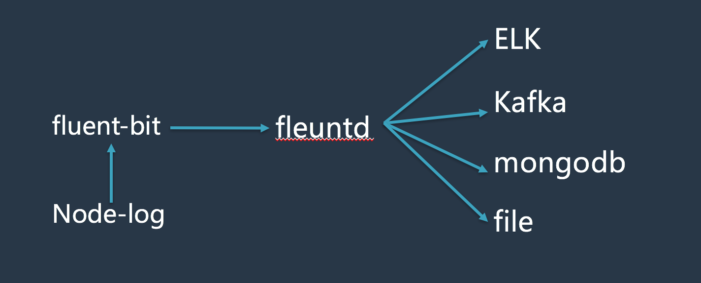

# 容器日志收集

[TOC]

### 一、日志方案

在kubenetes集群中收集容器日志，架构图如下：




说明：
- 由于采用官方提供的的fluentd在kubenetes集群中收集日志不是很稳定，经常会出现pod crash的情况，所以采用了另外一种方式对node上的日志进行收集（fluent-bit）
- 将使用fluent-bit收集到的日志传输到fluentd server端，使用不同的存储方式（ES、kafka、mongodb、file）进行存储。

### 二、fluent-bit介绍

Fluent Bit是一个开源和多平台的日志转发器 ，可以让您从不同来源收集数据/日志，统一并将其发送到多个目的地。它与Docker和Kubernetes环境完全兼容。

Fluent Bit用C编写，具有支持30个扩展的可插拔架构。它快速轻便，通过TLS提供网络操作所需的安全性。

### 三、安装

#### 3.1 客户端配置

```
# cat fluent-bit.conf
[SERVICE]
    Flush          1
    Daemon         Off
    Log_Level      info
    Parsers_File   parsers.conf

[INPUT]
    Name           tail
    Tag            kube.*
    Path           /data1/dockerdata/www/logs/*log
    Parser         docker
    DB             /var/log/flb_kube.db
    Mem_Buf_Limit  5MB

[FILTER]
    Name           kubernetes
    Match          kube.*
    Kube_URL       https://k8.hyserver.com.cn:443
    Merge_JSON_Log On


[OUTPUT]
    Name          forward
    Match         *
    Host          10.222.111.23
    Port          24225
```

如果需要直接存储到ES，OUTPUT配置如下：
```
[OUTPUT]
    Name   es
    Match  *
    Host     10.13.32.252
    #Host     elasticsearch-logging
    Port     9200
    #Host   ${FLUENT_ELASTICSEARCH_HOST}
    #Port   ${FLUENT_ELASTICSEARCH_PORT}
    Logstash_Format On
    Retry_Limit False
```

#### 3.2 客户端镜像创建

Dockerfile
```
FROM fluent/fluent-bit-kubernetes-daemonset:0.11
ADD fluent-bit.conf /fluent-bit/etc/fluent-bit.conf
```
镜像创建：
```
docker build -t registry.hyserver.com.cn/dpool/fluent-bit-daemonset_hy:0.11 .
```
push到镜像仓库：
```
docker push registry.hyserver.com.cn/dpool/fluent-bit-daemonset_hy:0.11
```

#### 3.3 在kubernetes集群的每一个node上创建pod

##### 3.3.1 yml文件
fluent-bit-daemonset-elasticsearch.yml
```
apiVersion: extensions/v1beta1
kind: DaemonSet
metadata:
  name: fluent-bit
  namespace: kube-system
  labels:
    k8s-app: fluent-bit-logging
    version: v1
    kubernetes.io/cluster-service: "true"
spec:
  template:
    metadata:
      labels:
        k8s-app: fluent-bit-logging
        version: v1
        kubernetes.io/cluster-service: "true"
    spec:
      containers:
      - name: fluent-bit
        image: registry.hyserver.com.cn/log/fluent-bit-daemonset_hy7:0.11
        env:
          - name:  FLUENT_ELASTICSEARCH_HOST
            value: "elasticsearch-logging"
          - name:  FLUENT_ELASTICSEARCH_PORT
            value: "9200"
        resources:
          limits:
            memory: 100Mi
          requests:
            cpu: 100m
            memory: 100Mi
        volumeMounts:
        - name: varlog
          mountPath: /var/log
        - name: varlibdockercontainers
          mountPath: /data1/dockerdata/www/logs
          readOnly: true
      terminationGracePeriodSeconds: 10
      volumes:
      - name: varlog
        hostPath:
          path: /var/log
      - name: varlibdockercontainers
        hostPath:
          path: /data1/dockerdata/www/logs
```
##### 3.3.2 pod的创建

```
kubectl create -f fluent-bit-daemonset-elasticsearch.yaml
```

### 四、查看是否正常工作

```
[root@252 ~]# kubectl get pods -n kube-system
NAME                                        READY     STATUS             RESTARTS   AGE
fluent-bit-203lm                            1/1       Running            0          36m
fluent-bit-4p7l1                            1/1       Running            0          36m
fluent-bit-68w8m                            1/1       Running            0          36m
fluent-bit-9mdqx                            1/1       Running            0          36m
fluent-bit-9mm3p                            1/1       Running            0          36m
fluent-bit-9v0kz                            1/1       Running            0          36m
fluent-bit-b3zvc                            1/1       Running            0          36m
fluent-bit-hvs32                            1/1       Running            0          36m
fluent-bit-jqd9x                            1/1       Running            0          36m
fluent-bit-mqs9x                            1/1       Running            0          36m
fluent-bit-n85f2                            1/1       Running            0          36m
fluent-bit-q03kt                            1/1       Running            0          36m
fluent-bit-s9lxh                            1/1       Running            0          36m
fluent-bit-zt3x7                            1/1       Running            0          36m
```

### 五、服务端部署

服务端使用fluentd进行接收，并进行不同方式的存储

#### 5.1 Dockerfile：
```
FROM docker.io/fluent/fluentd:v0.14.15
RUN  fluent-gem install  fluent-plugin-forest
RUN fluent-gem install fluent-plugin-elasticsearch
RUN fluent-gem install fluent-plugin-kafka
```

#### 5.2 打镜像
```
docker build -t registry.hyserver.com.cn/hyserver/fluentd_forest_elasticsearch_kafka:v0.14.15 .
```

#### 5.3 启动一个服务端容器

```
docker run -it -d --name fluentd_master -p 24225:24225 -p 24225:24224/udp -v /data2/fluentd/etc:/fluentd/etc -v /data2/fluentd/log:/fluentd/log fluentd_forest_elasticsearch_kafka:v0.14.15
```
#### 5.4 服务端配置

```
<source>
  @type forward
  port 24224
  bind 0.0.0.0
</source>

<match **>
  type forest
  subtype copy
  remove_prefix kube.data1.dockerdata.www.logs
  <template>
    <store>
      type file
      time_format %Y%m%dT%H%M%S%z
      time_slice_format %Y%m%d%H
      path /fluentd/log/__ESCAPED_TAG__.*
      buffer_path /fluentd/log/k8s_log/__ESCAPED_TAG__.*
      flush_interval 1h
    </store>
    <store>
      type elasticsearch
      host ELK_IP
      port 9200
      include_tag_key true
      tag_key @log_name
      logstash_format true
      flush_interval 2s
    </store>
    <store>
      type kafka_buffered
      brokers Kafka_serverIP01:port,Kafka_serverIP02:port,Kafka_serverIP03:port
      buffer_type file
      buffer_path /fluentd/log/kafka/buffer/td
      flush_interval 3s
      default_topic sinabip_test
      output_data_type json
      max_send_retries 1
      required_acks -1
    </store>
  </template>
</match>
```
通过上述配置，我们可以将客户端传输过来的日志以不同的方式进行存储（发送到ES、kafka、本地文件）。

- 参考文档：
```
http://fluentbit.io/documentation/0.11/
https://docs.fluentd.org/v0.12/articles/quickstart
https://github.com/fluent/fluentd/tree/master/example
```
